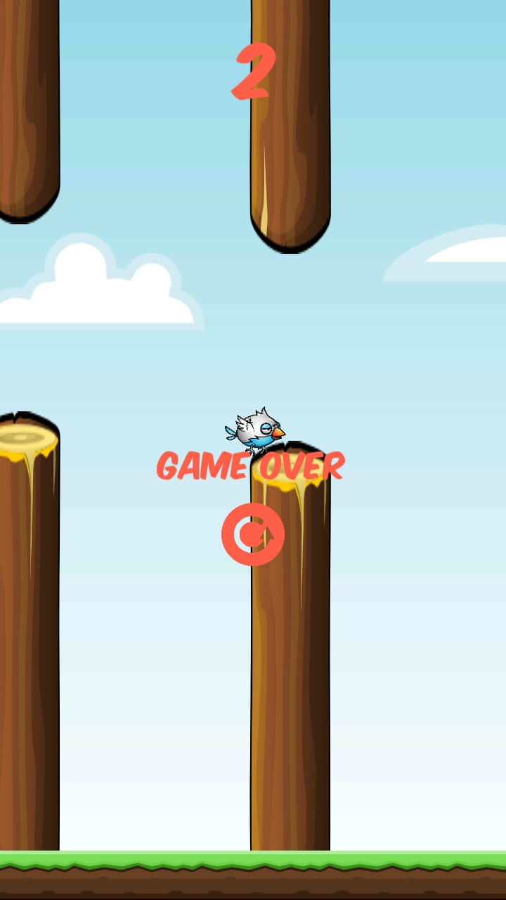

---------------------------------

#### Android game, developed in Unity.

* A remake of the Flappy Bird arcade game.
* I don't own any of the art used in this project.
* Every pack used comes from free sources.
* All authors of every single art pack are identified below.
* The game is playable on your Android device, by downloading the **.apk** file in this repository and allowing your device to install from unknown sources.

----------------------------------

Starting Screen

----------------------------------

Gameplay

----------------------------------

Game Over

----------------------------------

#### Art

Background and Pidgeon character by: Bevouliin
* Please visit (www.bevouliin.com) to check this artist's work.

Successful Pass & Game Over sound by: akelley6
* Please visit (www.freesound.org/people/akelley6) to check this artist's work.

Hop sound by: OwlStorm
* Please visit (www.freesound.org/people/OwlStorm) to check this artist's work.

Logo Font by: Youssef Habchi
* Please visit (www.youssef-habchi.com) to check this artist's work.

Texts Font by: Larry Yerkes
* Please visit (www.dafont.com/vigilante-typeface-corporation.d91) to check this artist's work.

Icons by: Chanut Wongrattana
* Please visit (www.flaticon.com/authors/chanut) to check this artist's work.
